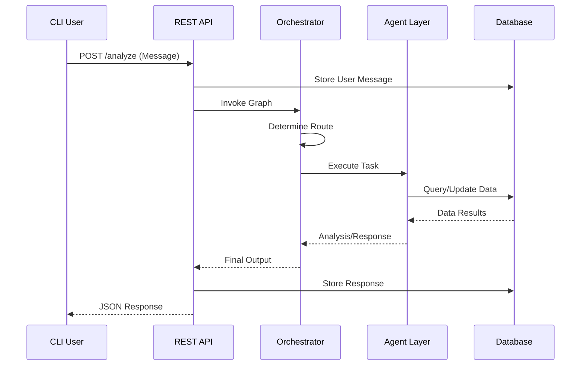
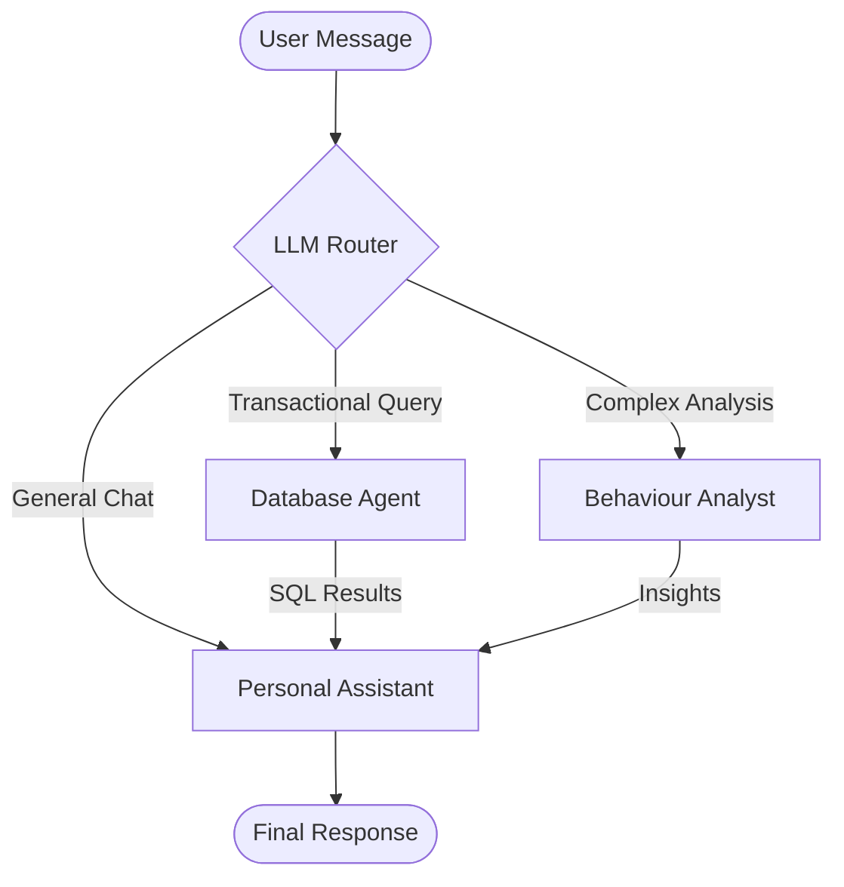
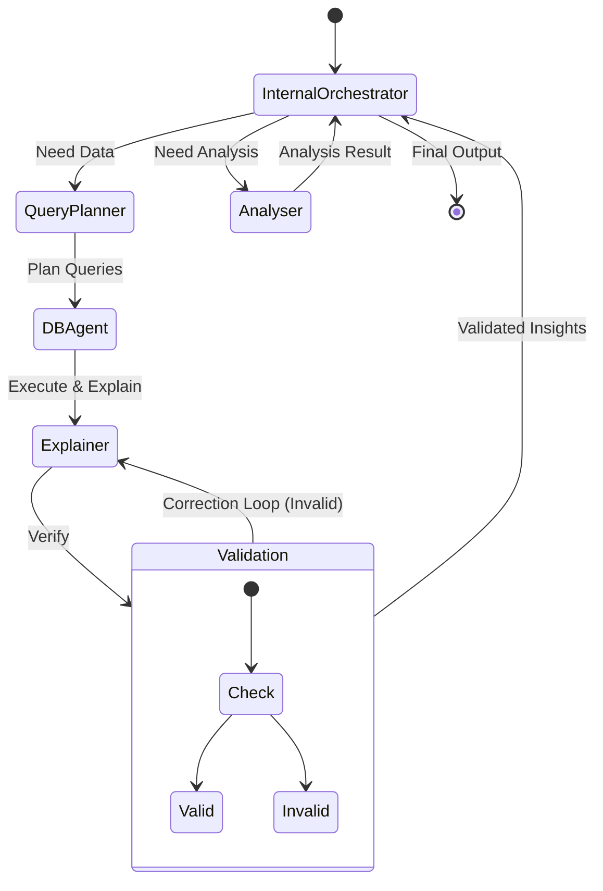
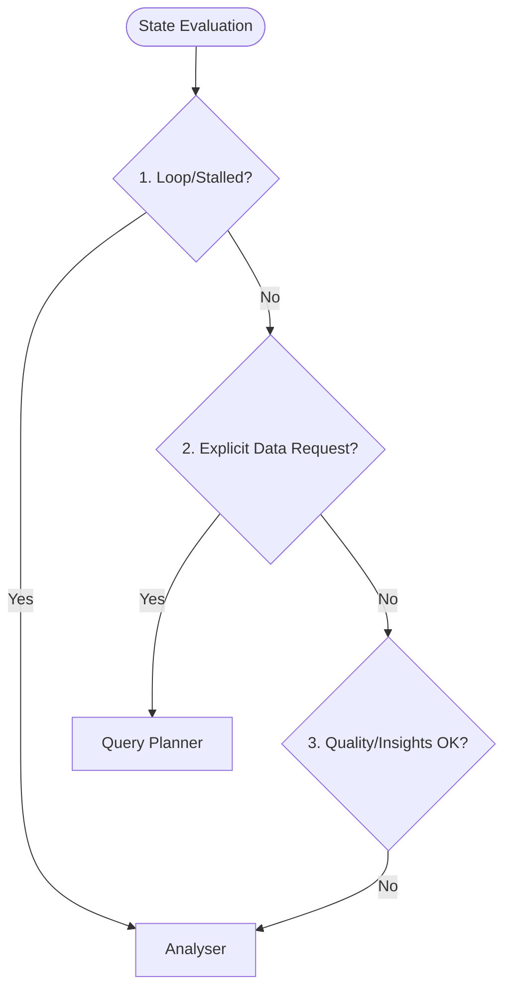
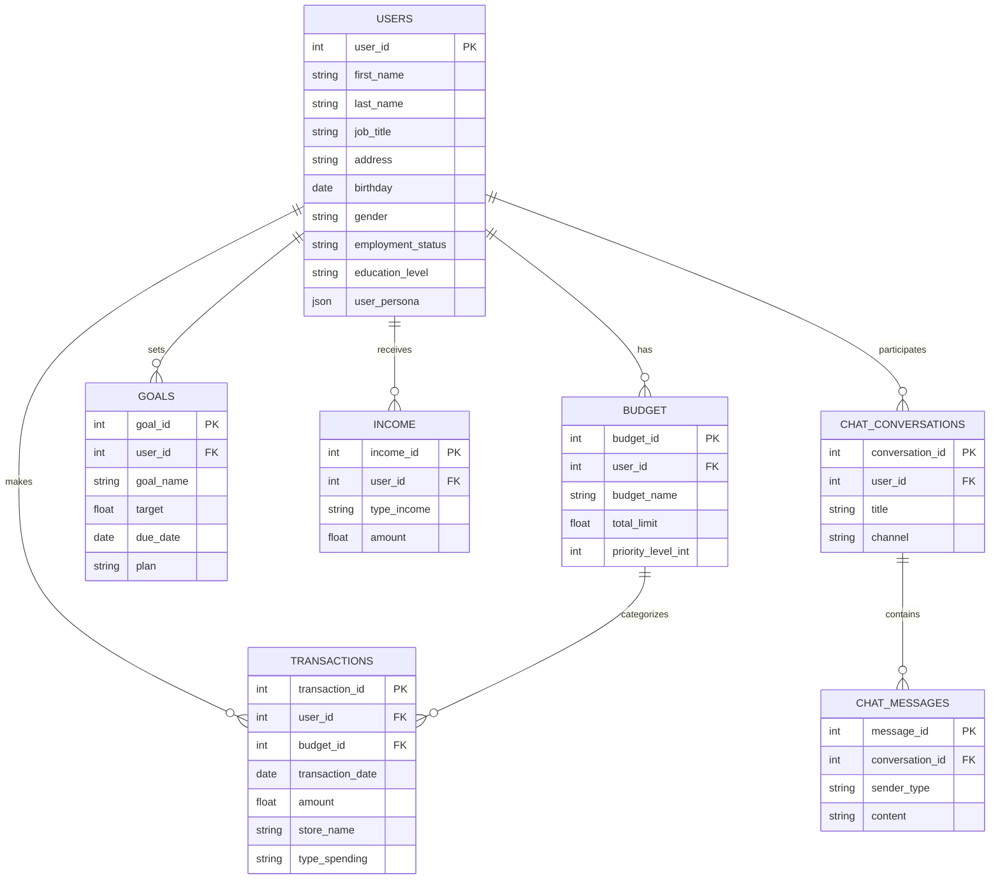

# Multi-Agent Personal Finance Assistant
## Graduation Project Comprehensive Report

---

## 1. Introduction

### 1.1 Project Overview
The **Multi-Agent Personal Finance Assistant** is an advanced software system designed to democratize financial literacy and management. By leveraging the power of Large Language Models (LLMs) and a multi-agent architecture, the system provides users with a natural language interface to query, analyze, and manage their personal financial data. Unlike traditional finance apps that rely on rigid dashboards, this system engages users in conversation, understanding context, intent, and complex analytical requests.

### 1.2 Problem Statement
Personal finance management is often hindered by complexity and a lack of accessible tools. Users struggle to:
*   Aggregate data from various sources (income, expenses, budgets).
*   Derive meaningful insights from raw transaction data.
*   Receive personalized advice tailored to their specific financial situation.
*   Interact with their data intuitively without learning complex software interfaces.

Existing solutions are either too simple (manual spreadsheets) or too complex (enterprise accounting software). There is a significant gap for an intelligent, conversational agent that acts as a dedicated financial advisor.

### 1.3 Objectives
The primary objectives of this project are:
1.  **Develop a Multi-Agent Architecture**: To specialize tasks (database querying, behavior analysis, conversation) for higher accuracy and reliability.
2.  **Implement Natural Language Understanding**: To allow users to ask questions like "How much did I spend on food last month?" or "Why am I over budget?".
3.  **Ensure Data Persistence and Security**: To securely store user profiles, transactions, and conversation history using a robust relational database.
4.  **Provide Actionable Insights**: To go beyond data retrieval and offer "Behaviour Analysis" that identifies spending patterns and suggests improvements.

---

## 2. System Architecture

### 2.1 High-Level Design
The system follows a **Micro-Service inspired Monolithic Architecture**, where distinct logical components interact through well-defined interfaces. The core components are:

1.  **Client Layer**: A Command Line Interface (CLI) that serves as the user entry point. It communicates exclusively via HTTP REST APIs.
2.  **API Layer**: A **Django Ninja** web service that acts as the secure gateway.
    *   **Validation**: Uses Pydantic schemas to validate every request body and query parameter.
    *   **Async Handling**: Offloads heavy LLM tasks to background threads to keep the server responsive.
    *   **Persistence**: Automatically logs every request/response pair to the `chat_messages` table.

    *   **Persistence**: Automatically logs every request/response pair to the `chat_messages` table.

3.  **Orchestration Layer**: Built with **LangGraph**, this layer manages the state of the conversation and routes tasks to specialized agents.
4.  **Agent Layer**: Independent modules responsible for specific domains (SQL generation, Data Analysis, Chat).
5.  **Data Layer**: A PostgreSQL database storing structured financial data and unstructured conversation logs.



### 2.2 Orchestration Pattern (The "Supervisor")
The system utilizes a **Supervisor/Router** pattern implemented in `graphs/main_graph.py`.
*   **Input**: The user's message enters the `personal_assistant_orchestrator`.
*   **Routing**: A lightweight LLM (`gpt_oss_llm`) analyzes the intent and outputs a structured `RoutingDecision`.
    *   *Transactional Queries* $\rightarrow$ **Database Agent**
    *   *Complex Analysis* $\rightarrow$ **Behaviour Analyst**
    *   *General Chat* $\rightarrow$ **Personal Assistant**
*   **Execution**: The selected agent executes its task, potentially calling sub-graphs.
*   **Response**: The result is fed back to the `PersonalAssistant` agent to generate a natural language response, ensuring a consistent persona.



### 2.3 Agent Design

#### 2.3.1 Personal Assistant (The "Face")
*   **Role**: Manages the conversation flow, maintains memory, and humanizes technical outputs.
*   **Memory**: Stateless architecture. Fetches conversation history from the database for every request to ensure thread safety and context continuity.
*   **Persona**: Configured via system prompts to be empathetic, professional, and proactive.

#### 2.3.2 Database Agent (The "Analyst")
*   **Role**: Translates natural language into executable SQL queries.
*   **Mechanism**:
    1.  Receives a schema definition in its prompt.
    2.  Generates a PostgreSQL-compliant query.
    3.  Returns a structured object `{"query": "...", "edit": bool, "message": "..."}`.
*   **Safety**: **Strictly Read-Only**. All `INSERT`, `UPDATE`, `DELETE` operations are forbidden and will be rejected by the agent.
*   **Validation**: The `message` field allows the agent to return natural language validation errors or confirmation messages.

#### 2.3.3 Behaviour Analyst (The "Advisor")
*   **Role**: Performs multi-step reasoning to explain *why* something happened.
*   **Sub-Graph Architecture**:
    *   **Query Planner**: Breaks down a complex question (e.g., "Compare my food spending to last year") into multiple SQL steps.
    *   **DB Agent**: Executes these steps in parallel.
    *   **Explainer**: Synthesizes the data into a narrative.
    *   **Psychological Profiling**: The Analyser now evaluates spending behavior for patterns like "Emotional Spending", "Impulse Buying", and "Goal Alignment" to provide deeper insights.
    *   **Loop Prevention**: Mechanisms are in place to detect stalled progress or repeated requests, ensuring the agent gracefully handles missing data.
    *   **Validation**: A self-correction loop where an LLM critiques the explanation against the raw data to ensure hallucination-free insights.



### 2.3.4 Orchestrator Decision Logic
The Orchestrator follows a strict evaluation pipeline to prevent loops and ensure quality:



**Figure: Orchestrator Decision Logic**

#### 2.3.5 Transaction Management
Transaction addition is no longer handled by the main router or the Database Agent. Instead, it is offloaded to the **Transaction Maker Agent** (Section 4.7) to ensure structured data entry, validation against active budgets, and a dedicated user experience.

**Key Features:**
*   **Context Awareness**: The agent has access to the conversation history, allowing it to remember previously provided details and avoid repetitive questions.
*   **Comprehensive Data Capture**: It intelligently extracts optional fields like `time`, `city`, `neighbourhood`, and `store_name` if provided, or asks for them if missing (only once).
*   **Budget Mapping**: Automatically maps natural language categories to active budget IDs.

#### 2.3.6 Budget Maker Agent
*   **Role**: Helps users define clear, realistic monthly budgets.
*   **Features**:
    *   **Context Analysis**: Checks income vs. total budgets and recent spending to prevent over-budgeting.
    *   **Smart Categorization**: Standardizes vague categories (e.g., "fun money" -> "Entertainment").
    *   **Priority Logic**: Assigns priority levels (1-10) based on a hierarchy of needs (Critical, Important, Discretionary).
    *   **Interactive Dialogue**: Asks clarifying questions if details are missing or limits are unrealistic.
#### 2.3.7 Recommendation Agent (Extension)
*   **Role**: Provides external financial advice or news.
*   **Components**:
    *   **Scrapper**: Extracts meaningful content from web pages.
    *   **News Finder**: Searches for relevant financial news articles.

#### 2.3.8 Goal Maker Agent (Standalone)
*   **Role**: A specialized, standalone agent dedicated to helping users define and refine their financial goals.
*   **Independence**: Unlike the other agents, the Goal Maker operates outside the main Personal Assistant graph. It is accessed via a dedicated API endpoint (`/api/goals/assist`).
*   **Function**: It engages in a focused dialogue to turn vague aspirations (e.g., "I want to save money") into SMART goals (Specific, Measurable, Achievable, Relevant, Time-bound) and persists them to the `goals` table.

#### 2.3.9 Presentation Super Agent
*   **Role**: Generates visual reports and charts to present financial data effectively.
*   **Components**:
    *   **Orchestrator**: Routes tasks between the Visualizer and Writer agents.
    *   **Visualizer**: Creates charts and graphs based on data.
    *   **Writer**: Generates the narrative report.
*   **Output**: Produces a combined HTML/CSS/JS report for rich visualization.


## 3. Technical Implementation

### 3.1 Technology Stack
*   **Language**: Python 3.10+ (Type-hinted).
*   **Web Framework**: Django Ninja (chosen for its async support and Pydantic integration).
*   **LLM Orchestration**: LangGraph & LangChain.
*   **LLM Provider**: Azure OpenAI (GPT-5.1-Chat and GPT-OSS-120b).
*   **Database**: PostgreSQL 14+.
*   **Server**: Waitress (Production WSGI server for Windows).

### 3.2 Data Model (Schema)
The PostgreSQL database is normalized to ensure data integrity. Below is the complete schema and relationship diagram.



#### Full Schema Definition

```text
DATABASE SCHEMA (with field types):

TABLE: transactions (NO "updated_at" - only created_at exists)
  - transaction_id (bigint, PK)
  - date (date, not null)
  - amount (numeric(12,2), not null, CHECK amount >= 0)
  - time (time without time zone)
  - store_name (text)
  - city (text)
  - type_spending (text)
  - user_id (bigint, FK -> users.user_id)
  - budget_id (bigint, FK -> budget.budget_id)
  - neighbourhood (text)
  - created_at (timestamp without time zone, default now())

TABLE: budget
  - budget_id (bigint, PK)
  - user_id (bigint, FK -> users.user_id)
  - budget_name (text, not null)
  - description (text)
  - total_limit (numeric(12,2), default 0, CHECK total_limit >= 0)
  - priority_level_int (smallint, 1-10)
  - is_active (boolean, default true)
  - created_at (timestamp without time zone)
  - updated_at (timestamp without time zone)

TABLE: users
  - user_id (bigint, PK)
  - first_name (text, not null)
  - last_name (text, not null)
  - job_title (text, not null)
  - address (text, not null)
  - birthday (date, not null)
  - gender (gender_type: male|female)
  - employment_status (employment_categories: Employed Full-time|Part-time|Unemployed|Retired|Student)
  - education_level (edu_level: High school|Associate degree|Bachelor degree|Masters Degree|PhD)
  - created_at (timestamp without time zone)
  - updated_at (timestamp without time zone)
  - user_persona (jsonb)

TABLE: income
  - income_id (bigint, PK)
  - user_id (bigint, FK -> users.user_id)
  - type_income (text, not null)
  - amount (numeric(12,2), default 0, CHECK amount >= 0)
  - description (text)
  - created_at (timestamp without time zone)
  - updated_at (timestamp without time zone)

TABLE: goals
  - goal_id (bigint, PK)
  - user_id (bigint, FK -> users.user_id)
  - goal_name (text, not null)
  - description (text)
  - target (numeric(12,2), default 0, CHECK target >= 0)
  - start_date (date)
  - due_date (date)
  - status (text, default 'active')
  - plan (text)
  - created_at (timestamp without time zone)
  - updated_at (timestamp without time zone)

TABLE: chat_conversations
  - conversation_id (bigint, PK)
  - user_id (bigint, FK -> users.user_id)
  - title (text)
  - channel (text)
  - started_at (timestamp without time zone)
  - last_message_at (timestamp without time zone)
  - summary_text (text)
  - summary_created_at (timestamp without time zone)

TABLE: chat_messages
  - message_id (bigint, PK)
  - conversation_id (bigint, FK -> chat_conversations.conversation_id)
  - sender_type (text)
  - source_agent (text)
  - content (text)
  - content_type (text)
  - language (text)
  - created_at (timestamp without time zone)
```

### 3.3 Key Algorithms

#### Routing Logic (`personal_assistant_orchestrator`)
```python
# Simplified Logic
decision = llm.predict(user_input)
if decision == "database":
    return execute_sql(user_input)
elif decision == "analysis":
    return run_behaviour_graph(user_input)
else:
    return chat(user_input)
```

This approach guarantees that:
*   **No Cross-Talk**: Users never share memory space.
*   **Persistence**: Memory is durable and survives server restarts.
*   **Scalability**: The system can handle concurrent requests without locking issues.

---

## 4. User Manual & API Reference

### 4.1 Getting Started
1.  **Prerequisites**: Python 3.10, PostgreSQL.
2.  **Configuration**: Set `AZURE_OPENAI_API_KEY` and `DB_PASSWORD` in `.env`.
3.  **Run API**: `python run_server.py`
4.  **Run Client**: `python main.py`

### 4.2 API Endpoints

#### Assistant Agents
| Method | Endpoint | Description |
| :--- | :--- | :--- |
| `POST` | `/api/transaction/assist` | Natural language transaction entry agent. |
| `POST` | `/api/budget/assist` | Interactive budget creation agent. |
| `POST` | `/api/goals/assist` | Goal setting assistant. |
| `POST` | `/api/analyze` | General Personal Assistant chat. |

#### Database Resources
**Users**
| Method | Endpoint | Description |
| :--- | :--- | :--- |
| `GET` | `/api/database/users/{id}` | Get user profile details. |
| `POST` | `/api/database/users` | Create a new user profile. |
| `GET` | `/api/database/users/{id}/exists` | Check if a user ID exists. |

**Income**
| Method | Endpoint | Description |
| :--- | :--- | :--- |
| `GET` | `/api/database/income` | List all income sources. |
| `GET` | `/api/database/income/active` | List active income sources. |
| `POST` | `/api/database/income` | Add a new income source. |

**Transactions**
| Method | Endpoint | Description |
| :--- | :--- | :--- |
| `GET` | `/api/database/transactions` | List transactions (supports filtering). |
| `POST` | `/api/database/transactions` | Create a new transaction manually. |
| `PUT` | `/api/database/transactions/{id}` | Update a transaction. |
| `DELETE` | `/api/database/transactions/{id}` | Delete a transaction. |
| `GET` | `/api/database/transactions/search` | Advanced search for transactions. |

**Budgets**
| Method | Endpoint | Description |
| :--- | :--- | :--- |
| `GET` | `/api/database/budget` | List active budgets. |
| `POST` | `/api/database/budget` | Create a new budget. |
| `PUT` | `/api/database/budget/{id}` | Update a budget. |
| `DELETE` | `/api/database/budget/{id}` | Soft delete a budget. |

**Goals**
| Method | Endpoint | Description |
| :--- | :--- | :--- |
| `GET` | `/api/database/goals` | List goals. |
| `POST` | `/api/database/goals` | Create a new goal. |
| `DELETE` | `/api/database/goals/{id}` | Soft delete a goal. |

#### Analytics & History
| Method | Endpoint | Description |
| :--- | :--- | :--- |
| `GET` | `/api/database/analytics/monthly-spend` | Aggregate spending by budget category for the current month. |
| `GET` | `/api/database/analytics/overspend` | Identify overspent categories and net financial position. |
| `GET` | `/api/database/analytics/income-total` | Aggregate total income by type. |
| `GET` | `/api/database/conversations` | List past conversation sessions. |
| `GET` | `/api/database/messages` | Retrieve message history for a specific conversation. |

#### System Tools
| Method | Endpoint | Description |
| :--- | :--- | :--- |
| `POST` | `/api/database/execute/select` | Execute a raw read-only SQL query (Admin/Debug use). |
| `POST` | `/api/database/execute/modify` | Execute INSERT/UPDATE/DELETE SQL queries (Admin/Debug use). |

### 4.3 API Schemas
The API uses Pydantic models for request and response validation.

#### Analysis & Conversation
**AnalysisRequestSchema**
```json
{
  "query": "string",
  "filters": "dict (optional)",
  "metadata": "dict (optional)",
  "conversation_id": "int (optional)",
  "user_id": "int (optional)"
}
```

**ConversationStartSchema**
```json
{
  "user_id": "int",
  "channel": "string (default: 'web')"
}
```

#### Transactions
**TransactionCreateSchema**
```json
{
  "user_id": "int",
  "date": "YYYY-MM-DD",
  "amount": "decimal",
  "time": "HH:MM:SS (optional)",
  "store_name": "string (optional)",
  "city": "string (optional)",
  "type_spending": "string (optional)",
  "budget_id": "int (optional)",
  "neighbourhood": "string (optional)"
}
```

#### Budgets & Goals
**BudgetCreateSchema**
```json
{
  "user_id": "int",
  "budget_name": "string",
  "description": "string (optional)",
  "total_limit": "decimal",
  "priority_level_int": "int (optional)",
  "is_active": "bool (default: true)"
}
```

**BudgetUpdateSchema**
```json
{
  "budget_name": "string (optional)",
  "description": "string (optional)",
  "total_limit": "decimal (optional)",
  "priority_level_int": "int (optional)",
  "is_active": "bool (optional)"
}
```

**GoalCreateSchema**
```json
{
  "user_id": "int",
  "goal_name": "string",
  "description": "string (optional)",
  "target": "decimal",
  "start_date": "YYYY-MM-DD (optional)",
  "due_date": "YYYY-MM-DD (optional)",
  "status": "string (default: 'active')",
  "plan": "string (optional)"
}
```

#### Users & Income
**UserCreateSchema**
```json
{
  "user_id": "int (optional)",
  "first_name": "string",
  "last_name": "string",
  "job_title": "string",
  "address": "string",
  "birthday": "YYYY-MM-DD",
  "gender": "string",
  "employment_status": "string",
  "education_level": "string"
}
```

**IncomeCreateSchema**
```json
{
  "user_id": "int",
  "type_income": "string",
  "amount": "decimal",
  "description": "string (optional)"
}
```

**GoalMakerRequestSchema**
```json
{
  "user_id": "int",
  "user_request": "string",
  "conversation_id": "int (optional)"
}
```

**BudgetMakerRequestSchema**
```json
{
  "user_id": "int",
  "user_request": "string",
  "conversation_id": "int (optional)"
}
```

**TransactionMakerRequestSchema**
```json
{
  "user_id": "int",
  "user_request": "string",
  "conversation_id": "int (optional)"
}
  "is_done": "bool"
}
```

---

## 5. Future Scope & Conclusion

### 5.1 Future Improvements
*   **Dynamic Schema**: Automate the injection of the database schema into the LLM prompt to support schema migrations without code changes.
*   **Voice Interface**: Integrate Speech-to-Text (Whisper) for a fully voice-activated experience.

### 5.2 Conclusion
This project demonstrates the viability of using Multi-Agent Systems for complex domain-specific tasks. By decomposing the problem of "Financial Advice" into smaller, manageable components (Querying, Explaining, Chatting), we achieved a system that is both powerful and reliable. The architecture is scalable and provides a solid foundation for future fintech innovations.
