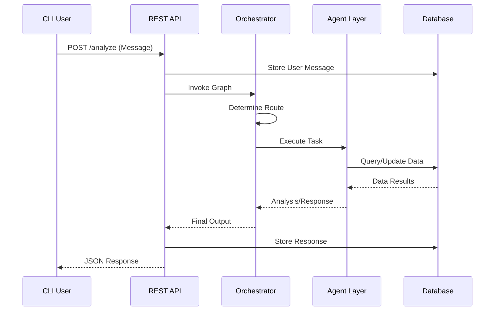
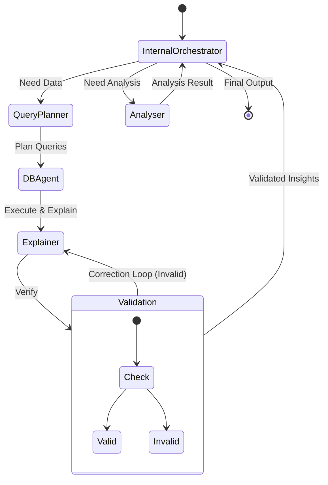
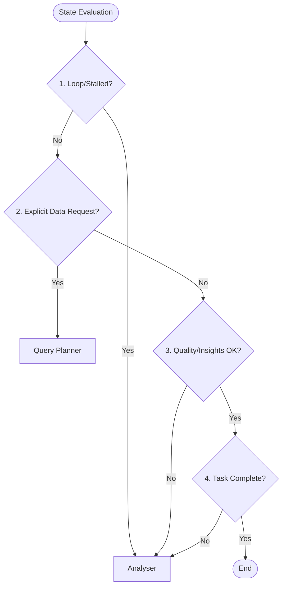

# Multi-Agent Personal Finance Assistant
## Graduation Project Comprehensive Report

---

## 1. Introduction

### 1.1 Project Overview
The **Multi-Agent Personal Finance Assistant** is an advanced software system designed to democratize financial literacy and management. By leveraging the power of Large Language Models (LLMs) and a multi-agent architecture, the system provides users with a natural language interface to query, analyze, and manage their personal financial data. Unlike traditional finance apps that rely on rigid dashboards, this system engages users in conversation, understanding context, intent, and complex analytical requests.

### 1.2 Problem Statement
Personal finance management is often hindered by complexity and a lack of accessible tools. Users struggle to:
*   Aggregate data from various sources (income, expenses, budgets).
*   Derive meaningful insights from raw transaction data.
*   Receive personalized advice tailored to their specific financial situation.
*   Interact with their data intuitively without learning complex software interfaces.

Existing solutions are either too simple (manual spreadsheets) or too complex (enterprise accounting software). There is a significant gap for an intelligent, conversational agent that acts as a dedicated financial advisor.

### 1.3 Objectives
The primary objectives of this project are:
1.  **Develop a Multi-Agent Architecture**: To specialize tasks (database querying, behavior analysis, conversation) for higher accuracy and reliability.
2.  **Implement Natural Language Understanding**: To allow users to ask questions like "How much did I spend on food last month?" or "Why am I over budget?".
3.  **Ensure Data Persistence and Security**: To securely store user profiles, transactions, and conversation history using a robust relational database.
4.  **Provide Actionable Insights**: To go beyond data retrieval and offer "Behaviour Analysis" that identifies spending patterns and suggests improvements.

---

## 2. System Architecture

### 2.1 High-Level Design
The system follows a **Micro-Service inspired Monolithic Architecture**, where distinct logical components interact through well-defined interfaces. The core components are:

1.  **Client Layer**: A Command Line Interface (CLI) that serves as the user entry point. It communicates exclusively via HTTP REST APIs.
2.  **API Layer**: A Django Ninja (FastAPI-like) web service that handles authentication, request validation, and routing.
3.  **Orchestration Layer**: Built with **LangGraph**, this layer manages the state of the conversation and routes tasks to specialized agents.
4.  **Agent Layer**: Independent modules responsible for specific domains (SQL generation, Data Analysis, Chat).
5.  **Data Layer**: A PostgreSQL database storing structured financial data and unstructured conversation logs.



### 2.2 Orchestration Pattern (The "Supervisor")
The system utilizes a **Supervisor/Router** pattern implemented in `graphs/main_graph.py`.
*   **Input**: The user's message enters the `personal_assistant_orchestrator`.
*   **Routing**: A lightweight LLM (`gpt_oss_llm`) analyzes the intent and outputs a structured `RoutingDecision`.
    *   *Transactional Queries* $\rightarrow$ **Database Agent**
    *   *Complex Analysis* $\rightarrow$ **Behaviour Analyst**
    *   *General Chat* $\rightarrow$ **Personal Assistant**
*   **Execution**: The selected agent executes its task, potentially calling sub-graphs.
*   **Response**: The result is fed back to the `PersonalAssistant` agent to generate a natural language response, ensuring a consistent persona.


### 2.3 Agent Design

#### 2.3.1 Personal Assistant (The "Face")
*   **Role**: Manages the conversation flow, maintains memory, and humanizes technical outputs.
*   **Memory**: Stateless architecture. Fetches conversation history from the database for every request to ensure thread safety and context continuity.
*   **Persona**: Configured via system prompts to be empathetic, professional, and proactive.

#### 2.3.2 Database Agent (The "Analyst")
*   **Role**: Translates natural language into executable SQL queries.
*   **Mechanism**:
    1.  Receives a schema definition in its prompt.
    2.  Generates a PostgreSQL-compliant query.
    3.  Returns a structured object `{"query": "...", "edit": bool}`.
*   **Safety**: Read-only queries are executed immediately; modification queries (INSERT/UPDATE) are flagged for potential future approval flows (currently auto-executed in this prototype).

#### 2.3.3 Behaviour Analyst (The "Advisor")
*   **Role**: Performs multi-step reasoning to explain *why* something happened.
*   **Sub-Graph Architecture**:
    *   **Query Planner**: Breaks down a complex question (e.g., "Compare my food spending to last year") into multiple SQL steps.
    *   **DB Agent**: Executes these steps in parallel.
    *   **Explainer**: Synthesizes the data into a narrative.
    *   **Psychological Profiling**: The Analyser now evaluates spending behavior for patterns like "Emotional Spending", "Impulse Buying", and "Goal Alignment" to provide deeper insights.
    *   **Loop Prevention**: Mechanisms are in place to detect stalled progress or repeated requests, ensuring the agent gracefully handles missing data.
    *   **Validation**: A self-correction loop where an LLM critiques the explanation against the raw data to ensure hallucination-free insights.



### 2.3.4 Orchestrator Decision Logic
The Orchestrator follows a strict evaluation pipeline to prevent loops and ensure quality:


    *   **Writer**: Drafts the narrative content.

#### 2.3.6 Trend Analysis Agent (Extension)
*   **Role**: Scans external data sources or internal logs to identify broad themes.
*   **Mechanism**: Extracts key themes, relevance scores, and supporting keywords to present a "digest" of financial trends relevant to the user's profile.

#### 2.3.7 Recommendation Agent (Extension)
*   **Role**: Provides external financial advice or news.
*   **Components**:
    *   **Scrapper**: Extracts meaningful content from web pages.
    *   **News Finder**: Searches for relevant financial news articles.

---

## 3. Technical Implementation

### 3.1 Technology Stack
*   **Language**: Python 3.10+ (Type-hinted).
*   **Web Framework**: Django Ninja (chosen for its async support and Pydantic integration).
*   **LLM Orchestration**: LangGraph & LangChain.
*   **LLM Provider**: Azure OpenAI (GPT-4o and GPT-3.5-Turbo).
*   **Database**: PostgreSQL 14+.
*   **Server**: Waitress (Production WSGI server for Windows).

### 3.2 Data Model (Schema)
The PostgreSQL database is normalized to ensure data integrity:
*   **`users`**: Core profile (ID, name, job, income summary).
*   **`transactions`**: Individual spend records (amount, date, category, merchant).
*   **`budget`**: Spending limits per category (Note: Limits are strictly **MONTHLY**).
*   **`goals`**: Financial targets (e.g., "Save for Car").
*   **`chat_conversations` & `chat_messages`**: Full audit trail of user-agent interactions.

### 3.3 Key Algorithms

#### Routing Logic (`personal_assistant_orchestrator`)
```python
# Simplified Logic
decision = llm.predict(user_input)
if decision == "database":
    return execute_sql(user_input)
elif decision == "analysis":
    return run_behaviour_graph(user_input)
else:
    return chat(user_input)
```

#### Validation Loop (`behaviour_analyst_sub_graph`)
The system employs a **Probabilistic Validation** mechanism.
1.  The `Explainer` generates an insight.
2.  The `ValidationAgent` checks the insight against the raw data rows.
3.  If invalid, the system loops back to the `Explainer` with specific feedback ("You said X, but data shows Y").
4.  This cycle repeats until valid or a recursion limit is reached.

### 3.4 Memory Management Strategy
The system employs a **Stateless Memory Pattern** to ensure thread safety and reliability in a multi-user environment.

1.  **External Fetching**: The Orchestrator (`main_graph.py`) instantiates a temporary `ConversationMemory` object for each incoming request.
2.  **Database Retrieval**: It fetches the most recent conversation turns (e.g., last 10 messages) from the PostgreSQL database.
3.  **Context Injection**: This history is formatted as a string and passed as an argument to the `PersonalAssistant` agent. Additionally, the **Current Date** is injected into the context of all agents (Orchestrator, Analyser, Query Planner) to enable accurate relative time reasoning (e.g., "this month").
4.  **Stateless Execution**: The Assistant processes the input (History + Current Message) without retaining any internal state.

This approach guarantees that:
*   **No Cross-Talk**: Users never share memory space.
*   **Persistence**: Memory is durable and survives server restarts.
*   **Scalability**: The system can handle concurrent requests without locking issues.

---

## 4. User Manual & API Reference

### 4.1 Getting Started
1.  **Prerequisites**: Python 3.10, PostgreSQL.
2.  **Configuration**: Set `AZURE_OPENAI_API_KEY` and `DB_PASSWORD` in `.env`.
3.  **Run API**: `python run_server.py`
4.  **Run Client**: `python main.py`

### 4.2 API Endpoints

#### Personal Assistant & Analysis
| Method | Endpoint | Description |
| :--- | :--- | :--- |
| `POST` | `/api/personal_assistant/conversations/start` | Start a new conversation session. Returns `conversation_id`. |
| `POST` | `/api/personal_assistant/analyze` | Main entry point. Sends user message, triggers agents, returns response + data. |
| `POST` | `/api/goals/assist` | Specialized endpoint for the Goal Maker agent to refine financial goals. |
| `GET` | `/api/personal_assistant/health` | Service health check. |

#### Database Retrieval (Transactions)
| Method | Endpoint | Description |
| :--- | :--- | :--- |
| `GET` | `/api/database/transactions` | List transactions with filters (date, limit). |
| `POST` | `/api/database/transactions` | Create a new transaction manually. |
| `PUT` | `/api/database/transactions/{id}` | Update an existing transaction. |
| `DELETE` | `/api/database/transactions/{id}` | Delete a transaction. |
| `GET` | `/api/database/transactions/search` | Advanced search (store name, category, amount range, city). |

#### Database Retrieval (Budget & Goals)
| Method | Endpoint | Description |
| :--- | :--- | :--- |
| `GET` | `/api/database/budget` | List active budgets. |
| `POST` | `/api/database/budget` | Create a new budget category. |
| `DELETE` | `/api/database/budget/{id}` | Soft delete (deactivate) a budget. |
| `GET` | `/api/database/goals` | List financial goals (filter by status). |
| `POST` | `/api/database/goals` | Create a new goal. |
| `DELETE` | `/api/database/goals/{id}` | Soft delete a goal. |

#### Database Retrieval (Users & Income)
| Method | Endpoint | Description |
| :--- | :--- | :--- |
| `GET` | `/api/database/users/{id}` | Get user profile details. |
| `POST` | `/api/database/users` | Create a new user profile. |
| `GET` | `/api/database/users/{id}/exists` | Check if a user ID exists. |
| `GET` | `/api/database/income` | List all income sources. |
| `POST` | `/api/database/income` | Add a new income source. |

#### Analytics & History
| Method | Endpoint | Description |
| :--- | :--- | :--- |
| `GET` | `/api/database/analytics/monthly-spend` | Aggregate spending by budget category for the current month. |
| `GET` | `/api/database/analytics/overspend` | Identify overspent categories and net financial position. |
| `GET` | `/api/database/analytics/income-total` | Aggregate total income by type. |
| `GET` | `/api/database/conversations` | List past conversation sessions. |
| `GET` | `/api/database/messages` | Retrieve message history for a specific conversation. |

#### System Tools
| Method | Endpoint | Description |
| :--- | :--- | :--- |
| `POST` | `/api/database/execute/select` | Execute a raw read-only SQL query (Admin/Debug use). |

### 4.3 API Schemas
The API uses Pydantic models for request and response validation.

#### Analysis & Conversation
**AnalysisRequestSchema**
```json
{
  "query": "string",
  "filters": "dict (optional)",
  "metadata": "dict (optional)",
  "conversation_id": "int (optional)",
  "user_id": "int (optional)"
}
```

**ConversationStartSchema**
```json
{
  "user_id": "int",
  "channel": "string (default: 'web')"
}
```

#### Transactions
**TransactionCreateSchema**
```json
{
  "user_id": "int",
  "date": "YYYY-MM-DD",
  "amount": "decimal",
  "time": "HH:MM:SS (optional)",
  "store_name": "string (optional)",
  "city": "string (optional)",
  "type_spending": "string (optional)",
  "budget_id": "int (optional)",
  "neighbourhood": "string (optional)"
}
```

#### Budgets & Goals
**BudgetCreateSchema**
```json
{
  "user_id": "int",
  "budget_name": "string",
  "description": "string (optional)",
  "total_limit": "decimal",
  "priority_level_int": "int (optional)",
  "is_active": "bool (default: true)"
}
```

**GoalCreateSchema**
```json
{
  "user_id": "int",
  "goal_name": "string",
  "description": "string (optional)",
  "target": "decimal",
  "start_date": "YYYY-MM-DD (optional)",
  "due_date": "YYYY-MM-DD (optional)",
  "status": "string (default: 'active')"
}
```

#### Users & Income
**UserCreateSchema**
```json
{
  "user_id": "int (optional)",
  "first_name": "string",
  "last_name": "string",
  "job_title": "string (optional)",
  "address": "string",
  "birthday": "YYYY-MM-DD",
  "gender": "string",
  "employment_status": "string",
  "education_level": "string"
}
```

**IncomeCreateSchema**
```json
{
  "user_id": "int",
  "type_income": "string",
  "amount": "decimal",
  "description": "string (optional)"
}
```

**GoalMakerRequestSchema**
```json
{
  "user_id": "int",
  "user_request": "string",
  "conversation_id": "int (optional)"
}
```

---

## 5. Future Scope & Conclusion

### 5.1 Future Improvements
*   **Dynamic Schema**: Automate the injection of the database schema into the LLM prompt to support schema migrations without code changes.
*   **Voice Interface**: Integrate Speech-to-Text (Whisper) for a fully voice-activated experience.

### 5.2 Conclusion
This project demonstrates the viability of using Multi-Agent Systems for complex domain-specific tasks. By decomposing the problem of "Financial Advice" into smaller, manageable components (Querying, Explaining, Chatting), we achieved a system that is both powerful and reliable. The architecture is scalable and provides a solid foundation for future fintech innovations.
