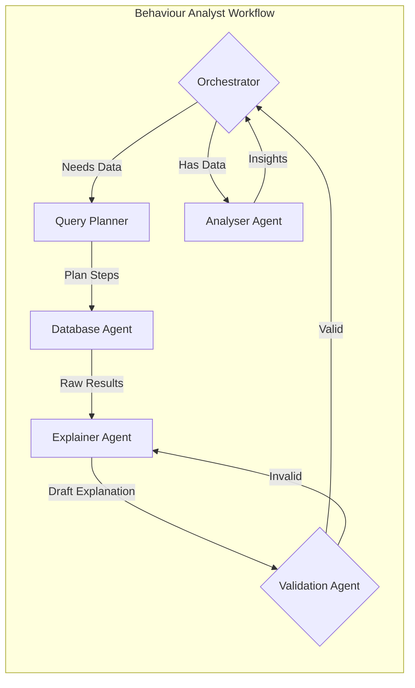
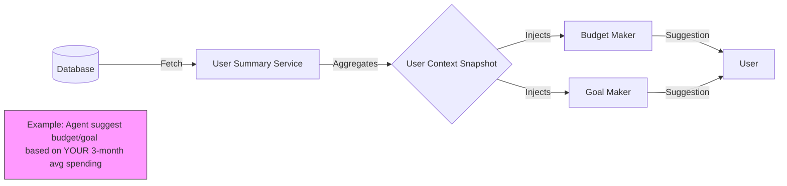
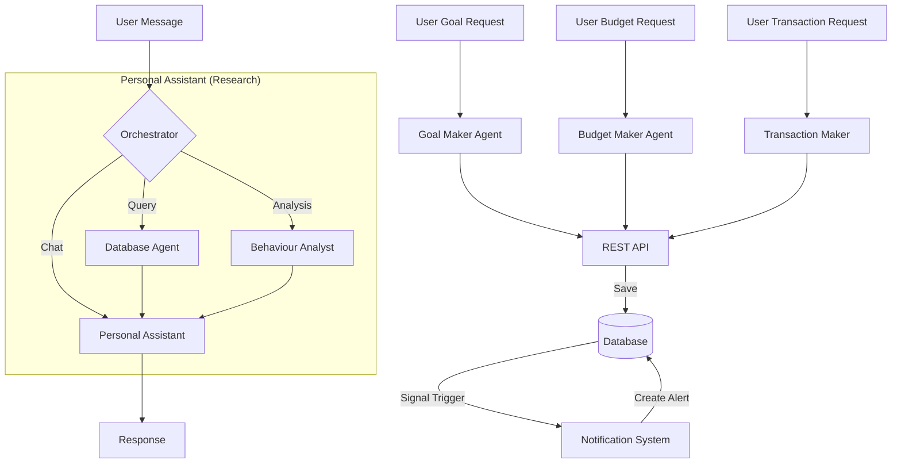
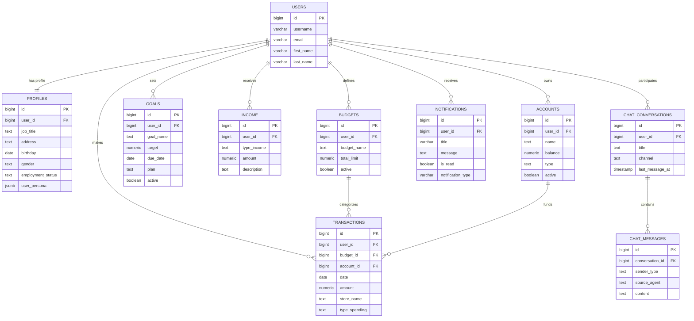

# Multi-Agent Personal Finance Assistant

An advanced, conversational financial advisor powered by Large Language Models (LLMs) and a multi-agent architecture. This system goes beyond simple data tracking to provide deep behavioral insights, psychological profiling, and actionable financial advice.

---

## 🚀 Key Features

*   **Conversational Interface**: Chat naturally with your financial data (e.g., "Why am I over budget this month?").
*   **Multi-Agent Architecture**: Specialized agents for different tasks:
    *   **Personal Assistant** (Research / Experimental): Manages the conversation and user context. Currently under active research to improve context retention and personality consistency. (Model: GPT-OSS-120B / Digital Ocean)
    *   **Database Agent**: Translates questions into SQL queries. (Model: GPT-OSS-120B / Digital Ocean)
    *   **Behaviour Analyst**: Analyzes spending patterns, detects "emotional spending," and identifies habits. (Model: GPT-OSS-120B / Digital Ocean)
    *   **Goal Maker**: Specialized agent for defining **and updating** SMART financial goals. (Model: GPT-OSS-120B / Digital Ocean)
    *   **Budget Maker**: Interactive agent for defining and updating budgets. (Model: GPT-OSS-120B / Digital Ocean)
    *   **Transaction Maker** (In Progress): Context-aware agent for recording detailed transactions. Currently under development. (Model: GPT-OSS-120B / Digital Ocean)
*   **Budget Notification System**: **[NEW]** Real-time alerts when spending exceeds defined budget limits.
*   **Psychological Profiling**: Understands the *why* behind your spending.
*   **Probabilistic Validation**: A corrective mechanism specifically for the **Explainer Agent** to ensure data accuracy before presenting it to the user.

## 🧠 Behaviour Analyst Sub-System (Future Roadmap / In Progress)

The **Behaviour Analyst** represents the **future vision** of this platform. While currently in an experimental research phase, our goal is to fully integratethis complex, self-contained multi-agent workflow to derive deep insights from raw data. It currently operates as a distinct subgraph:

1.  **Orchestrator**: The "Brain" that manages the analysis lifecycle. It decides whether to fetch more data, analyze existing data, or ask the user for clarification.
2.  **Query Planner**: Translates high-level analytic questions (e.g., "Analyze my food spending trends") into precise, step-by-step SQL planning instructions.
3.  **Database Agent**: Executes the planned queries against the PostgreSQL database in parallel.
4.  **Explainer Agent**: Converts raw JSON database results into natural, narrative text.
5.  **Validation Agent**: A probabilistic auditor that checks the Explainer's output against the raw data to prevent hallucinations. If issues are found, it loops back for correction.



## 🧠 Context-Awareness & Memory (Future Integration)

The "Maker" Agents (Budget, Goal, and Transaction Makers) are designed to possess **Deep Context** about the user via the `get_user_summary` injection system. This is a key part of our **future roadmap** to make agents truly intelligent.

When fully implemented, we will leverage the **Behaviour Analyst** sub-system to generate this context dynamically. Instead of simple statistics, the Analyst will provide deep psychological and behavioral insights (e.g., "User tends to overspend on weekends due to social pressure"), enabling the Maker Agents to offer truly personalized advice.

**Data Injected via `get_user_summary`:**
1.  **Profile**: Job title, employment status (e.g., "Freelancer" vs "Salaried").
2.  **Financial Health**: Total monthly income vs current active budgets.
3.  **Active Goals**: What you are saving for (prevents conflicting advice).
4.  **Spending Patterns**:
    *   3-Month Average Spending.
    *   Month-to-Date Spending.
    *   Top Spending Categories & Stores.



## 🛠️ System Architecture

The project follows a **Micro-Service inspired Monolithic Architecture**:

1.  **Client**: CLI or Web Interface.
2.  **API Layer**: Django Ninja (FastAPI-like) for handling requests.
3.  **Orchestrator**: LangGraph-based router that directs tasks.
4.  **Data Layer**: PostgreSQL database acting as the shared "World State".

### Collaborative Multi-Agent System (Shared State)

Unlike distributed systems where agents message each other directly, this architecture uses a **Centralized Shared Database** pattern.

*   **Agents are Decoupled**: The *Budget Maker* doesn't need to know the *Goal Maker* exists.
*   **The Database is the World**: Agents observe and modify the shared database state.
    *   *Example*: When the **Budget Maker** creates a new budget, it is immediately updated in the "World State". The **Behaviour Analyst** (in a separate session) can then instantly access this budget to provide context-aware spending insights, without the two agents ever communicating directly.
*   **Scalability**: This allows adding new agents (e.g., an Investment Advisor) without rewriting existing agents. They simply plug into the same data source.



## 💻 Tech Stack

*   **Language**: Python 3.10+
*   **Web Framework**: Django Ninja
*   **LLM Orchestration**: LangGraph & LangChain
*   **AI Models**: GPT-OSS-120B (Hosted on Digital Ocean) / Azure OpenAI (Configurable)
*   **Database**: PostgreSQL 14+
*   **Server**: Waitress (WSGI)

## 🔌 API Layer

The system exposes a robust REST API built with **Django Ninja**.

### Request Lifecycle
1.  **Validation**: Pydantic schemas ensure request integrity.
2.  **Orchestration**: Lazily loads and invokes the Graph Orchestrator.
3.  **Real-time Logic**: Django Signals handle immediate side-effects (like budget checks).
4.  **Persistence**: All interactions logged to PostgreSQL.

## 🏁 Getting Started

### Prerequisites
*   Python 3.10+
*   PostgreSQL

### Installation

1.  **Clone the repository**
    ```bash
    git clone <repository-url>
    cd Multi-Agent-System
    ```

2.  **Install Dependencies**
    ```bash
    pip install -r requirements.txt
    ```

3.  **Configure Environment**
    Create a `.env` file in the root directory:
    ```env
    DJANGO_SECRET_KEY=your_secret
    DB_PASSWORD=your_db_password
    # ... other settings
    ```

4.  **Run the Server**
    ```bash
    python run_server.py
    ```

## 🗄️ Database Schema

The system uses a normalized PostgreSQL database.



### Full Detailed Schema
For the complete field-level schema definition, please refer to the **[database_schema.txt](database_schema.txt)** file mapping the Django Models.