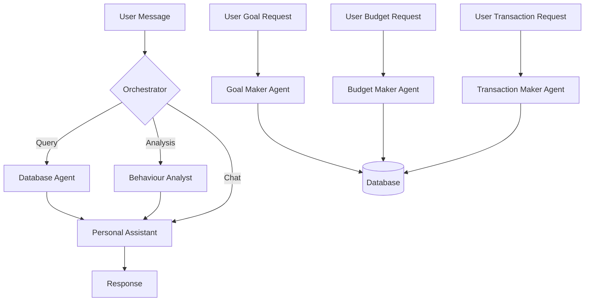
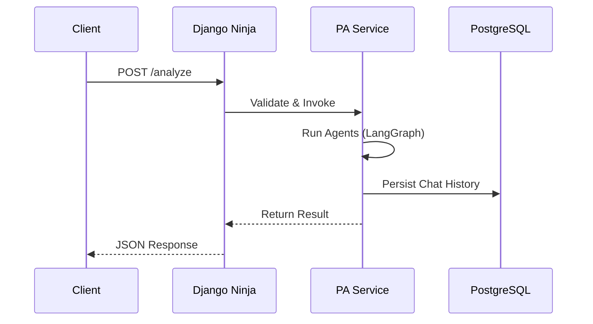
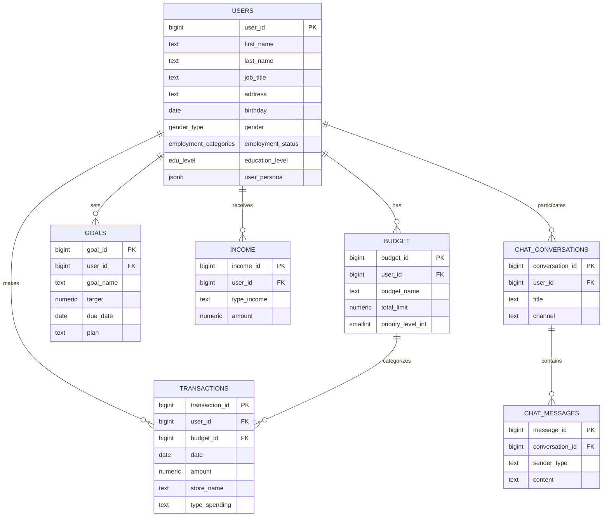

# Multi-Agent Personal Finance Assistant

An advanced, conversational financial advisor powered by Large Language Models (LLMs) and a multi-agent architecture. This system goes beyond simple data tracking to provide deep behavioral insights, psychological profiling, and actionable financial advice.

---

## 🚀 Key Features

*   **Conversational Interface**: Chat naturally with your financial data (e.g., "Why am I over budget this month?").
*   **Multi-Agent Architecture**: Specialized agents for different tasks:
    *   **Personal Assistant**: Manages the conversation and user context.
    *   **Database Agent**: Translates questions into SQL queries.
    *   **Behaviour Analyst**: Analyzes spending patterns, detects "emotional spending," and identifies habits.
    - **Goal Maker**: Specialized agent for setting SMART financial goals.
    - **Budget Maker**: Interactive agent for defining monthly budgets with priority levels.
    - **Transaction Maker**: Context-aware agent for recording detailed transactions (time, location, category) and mapping them to active budgets.
    - **Presentation Super Agent**: Generates visual reports and charts.
*   **Psychological Profiling**: Understands the *why* behind your spending (Retail Therapy, Impulse Buying, Social Pressure).
*   **Stateless Memory**: Thread-safe design ensuring privacy and scalability.
*   **Probabilistic Validation**: Self-correcting mechanism to ensure accurate, hallucination-free insights.

## 🛠️ System Architecture

The project follows a **Micro-Service inspired Monolithic Architecture**:

1.  **Client**: CLI or Web Interface.
2.  **API Layer**: Django Ninja (FastAPI-like) for handling requests.
3.  **Orchestrator**: LangGraph-based router that directs tasks to the right agent.
4.  **Data Layer**: PostgreSQL database for transactions, budgets, and goals.



## 💻 Tech Stack

*   **Language**: Python 3.10+
*   **Web Framework**: Django Ninja
*   **LLM Orchestration**: LangGraph & LangChain
*   **AI Models**: Azure OpenAI (GPT-5.1-Chat, GPT-OSS-120b)
*   **Database**: PostgreSQL 14+
*   **Server**: Waitress (WSGI)

## 🔌 API Layer (How it Works)

The system exposes a robust REST API built with **Django Ninja**. It acts as the gateway between the user and the intelligent agents.

### Request Lifecycle
1.  **Validation**: Pydantic schemas ensure all requests are well-formed.
2.  **Orchestration**: The API calls the `PersonalAssistantService`, which spins up the LangGraph agents.
3.  **Async Execution**: Long-running analysis tasks are handled asynchronously to keep the server responsive.
4.  **Persistence**: Every interaction is automatically logged to the PostgreSQL database for memory and auditing.



## 🏁 Getting Started

### Prerequisites
*   Python 3.10+
*   PostgreSQL

### Installation

1.  **Clone the repository**
    ```bash
    git clone <repository-url>
    cd Multi-Agent-System
    ```

2.  **Install Dependencies**
    ```bash
    pip install -r requirements.txt
    ```

3.  **Configure Environment**
    Create a `.env` file in the root directory and add your credentials:
    ```env
    AZURE_OPENAI_API_KEY=your_key
    DB_PASSWORD=your_db_password
    # ... other settings
    ```

4.  **Run the Server**
    ```bash
    python run_server.py
    ```

5.  **Run the Client**
    ```bash
    python main.py
    ```

## 📚 Documentation

For a deep dive into the system's design, logic, and API reference, please refer to the [Comprehensive Documentation](COMPREHENSIVE_DOCUMENTATION.md).

## 🗄️ Database Schema

The system uses a normalized PostgreSQL database. Below is the complete schema and relationship diagram.



### Full Schema Definition

```text
DATABASE SCHEMA (with field types):

TABLE: transactions (NO "updated_at" - only created_at exists)
  - transaction_id (bigint, PK)
  - date (date, not null)
  - amount (numeric(12,2), not null, CHECK amount >= 0)
  - time (time without time zone)
  - store_name (text)
  - city (text)
  - type_spending (text)
  - user_id (bigint, FK -> users.user_id)
  - budget_id (bigint, FK -> budget.budget_id)
  - neighbourhood (text)
  - created_at (timestamp without time zone, default now())

TABLE: budget
  - budget_id (bigint, PK)
  - user_id (bigint, FK -> users.user_id)
  - budget_name (text, not null)
  - description (text)
  - total_limit (numeric(12,2), default 0, CHECK total_limit >= 0)
  - priority_level_int (smallint, 1-10)
  - is_active (boolean, default true)
  - created_at (timestamp without time zone)
  - updated_at (timestamp without time zone)

TABLE: users
  - user_id (bigint, PK)
  - first_name (text, not null)
  - last_name (text, not null)
  - job_title (text, not null)
  - address (text, not null)
  - birthday (date, not null)
  - gender (gender_type: male|female)
  - employment_status (employment_categories: Employed Full-time|Part-time|Unemployed|Retired|Student)
  - education_level (edu_level: High school|Associate degree|Bachelor degree|Masters Degree|PhD)
  - created_at (timestamp without time zone)
  - updated_at (timestamp without time zone)
  - user_persona (jsonb)

TABLE: income
  - income_id (bigint, PK)
  - user_id (bigint, FK -> users.user_id)
  - type_income (text, not null)
  - amount (numeric(12,2), default 0, CHECK amount >= 0)
  - description (text)
  - created_at (timestamp without time zone)
  - updated_at (timestamp without time zone)

TABLE: goals
  - goal_id (bigint, PK)
  - user_id (bigint, FK -> users.user_id)
  - goal_name (text, not null)
  - description (text)
  - target (numeric(12,2), default 0, CHECK target >= 0)
  - start_date (date)
  - due_date (date)
  - status (text, default 'active')
  - plan (text)
  - created_at (timestamp without time zone)
  - updated_at (timestamp without time zone)

TABLE: chat_conversations
  - conversation_id (bigint, PK)
  - user_id (bigint, FK -> users.user_id)
  - title (text)
  - channel (text)
  - started_at (timestamp without time zone)
  - last_message_at (timestamp without time zone)
  - summary_text (text)
  - summary_created_at (timestamp without time zone)

TABLE: chat_messages
  - message_id (bigint, PK)
  - conversation_id (bigint, FK -> chat_conversations.conversation_id)
  - sender_type (text)
  - source_agent (text)
  - content (text)
  - content_type (text)
  - language (text)
  - created_at (timestamp without time zone)
```