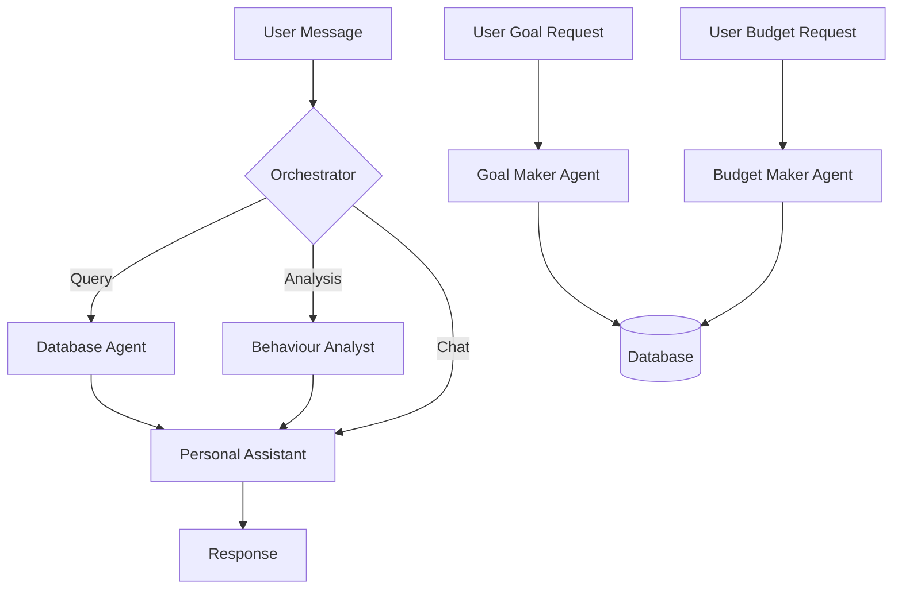
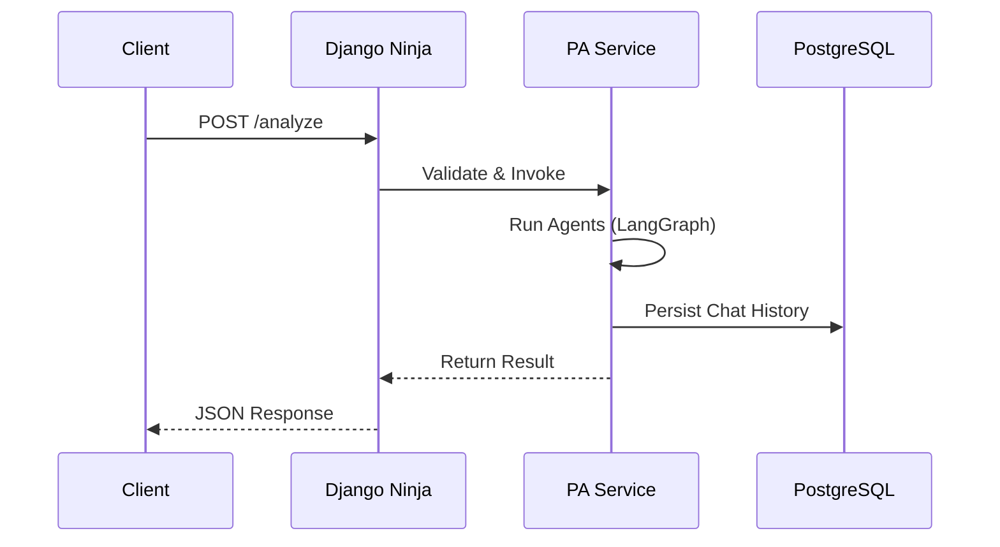

# Multi-Agent Personal Finance Assistant

An advanced, conversational financial advisor powered by Large Language Models (LLMs) and a multi-agent architecture. This system goes beyond simple data tracking to provide deep behavioral insights, psychological profiling, and actionable financial advice.

---

## 🚀 Key Features

*   **Conversational Interface**: Chat naturally with your financial data (e.g., "Why am I over budget this month?").
*   **Multi-Agent Architecture**: Specialized agents for different tasks:
    *   **Personal Assistant**: Manages the conversation and user context.
    *   **Database Agent**: Translates questions into SQL queries.
    *   **Behaviour Analyst**: Analyzes spending patterns, detects "emotional spending," and identifies habits.
    *   **Goal Maker**: Helps users define SMART financial goals.
    *   **Budget Maker**: Assists in setting realistic monthly budgets with priority levels.
*   **Psychological Profiling**: Understands the *why* behind your spending (Retail Therapy, Impulse Buying, Social Pressure).
*   **Stateless Memory**: Thread-safe design ensuring privacy and scalability.
*   **Probabilistic Validation**: Self-correcting mechanism to ensure accurate, hallucination-free insights.

## 🛠️ System Architecture

The project follows a **Micro-Service inspired Monolithic Architecture**:

1.  **Client**: CLI or Web Interface.
2.  **API Layer**: Django Ninja (FastAPI-like) for handling requests.
3.  **Orchestrator**: LangGraph-based router that directs tasks to the right agent.
4.  **Data Layer**: PostgreSQL database for transactions, budgets, and goals.



## 💻 Tech Stack

*   **Language**: Python 3.10+
*   **Web Framework**: Django Ninja
*   **LLM Orchestration**: LangGraph & LangChain
*   **AI Models**: Azure OpenAI (GPT-5.1-Chat, GPT-OSS-120b)
*   **Database**: PostgreSQL 14+
*   **Server**: Waitress (WSGI)

## 🔌 API Layer (How it Works)

The system exposes a robust REST API built with **Django Ninja**. It acts as the gateway between the user and the intelligent agents.

### Request Lifecycle
1.  **Validation**: Pydantic schemas ensure all requests are well-formed.
2.  **Orchestration**: The API calls the `PersonalAssistantService`, which spins up the LangGraph agents.
3.  **Async Execution**: Long-running analysis tasks are handled asynchronously to keep the server responsive.
4.  **Persistence**: Every interaction is automatically logged to the PostgreSQL database for memory and auditing.



## 🏁 Getting Started

### Prerequisites
*   Python 3.10+
*   PostgreSQL

### Installation

1.  **Clone the repository**
    ```bash
    git clone <repository-url>
    cd Multi-Agent-System
    ```

2.  **Install Dependencies**
    ```bash
    pip install -r requirements.txt
    ```

3.  **Configure Environment**
    Create a `.env` file in the root directory and add your credentials:
    ```env
    AZURE_OPENAI_API_KEY=your_key
    DB_PASSWORD=your_db_password
    # ... other settings
    ```

4.  **Run the Server**
    ```bash
    python run_server.py
    ```

5.  **Run the Client**
    ```bash
    python main.py
    ```

## 📚 Documentation

For a deep dive into the system's design, logic, and API reference, please refer to the [Comprehensive Documentation](COMPREHENSIVE_DOCUMENTATION.md).