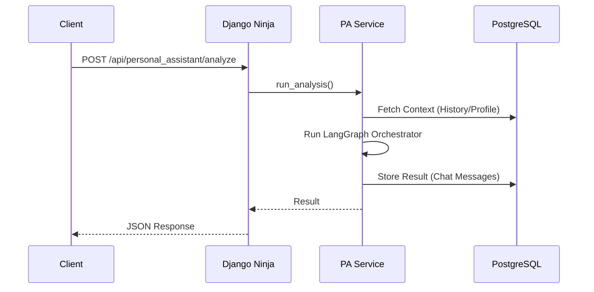
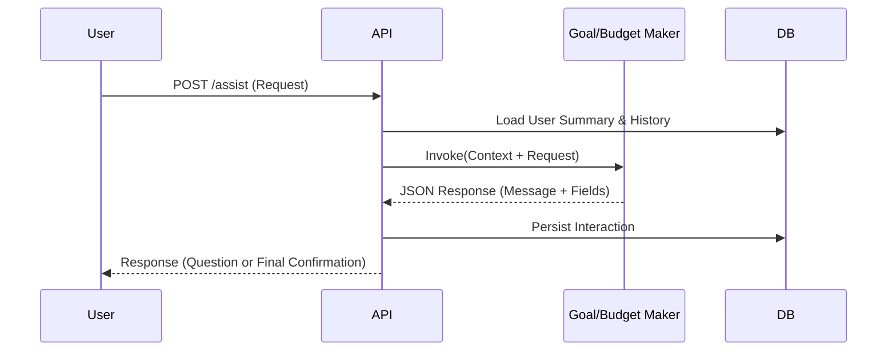
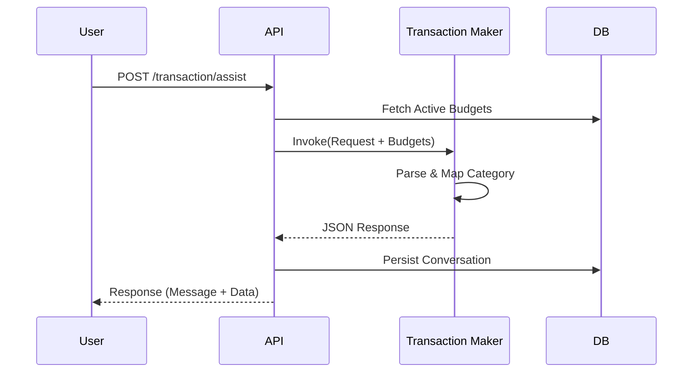
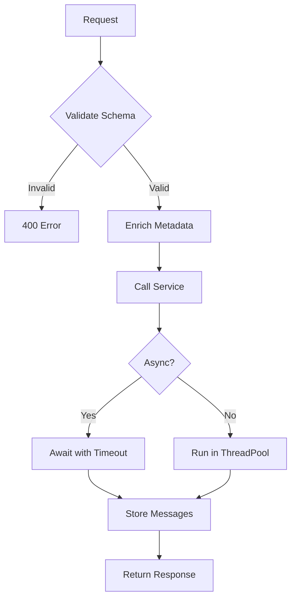

**Executive Summary**
- Django + Ninja REST API serving a multi-agent Personal Assistant.
- Async endpoints orchestrate LangGraph agents, persist conversations, and expose domain data.
- Defaults emphasize safety: parameterized SQL, guarded write routes, validated schemas, and consistent logging.

**Entry Points**
- Base path (all environments): `/api/`
- Docs UI: `/api/docs`
- Production base URL: `https://grad-pth6g.ondigitalocean.app/api`
  - All external clients (CLI, web apps, integrations) should set `API_BASE_URL=https://grad-pth6g.ondigitalocean.app/api`.
  - The platform terminates TLS and forwards to the container.
- Routers:
  - `/api/personal_assistant/*` (api/personal_assistant_api/api.py)
  - `/api/database/*` (api/personal_assistant_api/db_retrieval.py)



**Directory Layout**
- `api/api_config`: Django project wiring (settings, URLs, ASGI/WSGI).
- `api/personal_assistant_api`: Endpoints, services, and schemas.
- `api/run_server.py`: Production entry (Waitress WSGI).
- `api/requirements.txt`: API dependencies.

**Modules**
- `api/personal_assistant_api/api.py`
  - Conversation endpoints: start session, analyze query, health.
  - `_insert_chat_message` centralizes `chat_messages` inserts.
  - `_store_messages_sync` records user/assistant messages and optional JSON data; updates `chat_conversations.last_message_at`.
  - `_get_user_summary` and `_get_conversation_summary` build goal-aware context (profile, income, goals, and recent spending patterns) for specialized agents.
  - Goal Maker endpoint `/api/personal_assistant/goals/assist` provides a structured goal-setting conversation with per-conversation memory.
- `api/personal_assistant_api/services.py`
  - `PersonalAssistantService` lazily loads `graphs.main_graph.main_orchestrator_graph`.
  - `run_analysis` handles async (`ainvoke`) and sync (`invoke` in executor) orchestrators and normalizes results.
  - Includes comprehensive error handling and performance timing.
- `api/personal_assistant_api/db_retrieval.py`
  - `_run_select` and `_execute_modify` centralize database I/O; `_safe_json_body` only backs the generic SQL helpers.
  - `fetch_active_budgets` is a reusable helper that retrieves active budgets for both the API and the Router.
  - CRUD endpoints use Pydantic request schemas so Ninja validates payloads (see `TransactionCreateSchema`, `BudgetCreateSchema`, etc.).
  - Transaction responses include `budget_name`, and `/users/{user_id}/exists` returns a minimal profile for quick lookups.
  - Overspend analytics now returns category rows plus a `summary` block with total income, total spend, and net position.
- `api/personal_assistant_api/schemas.py`
  - Pydantic schemas for request/response validation and OpenAPI.
- `graphs/main_graph.py`
  - Main orchestrator with `personal_assistant_orchestrator`, `database_agent_node`, `behaviour_analyst_node`, and `personal_assistant_response`.
  - `database_agent_node` includes 10-second timeout protection and enhanced error handling.
  - PersonalAssistant instance management ensures proper context isolation across conversations.
  - Database agent receives combined user ask and routing instruction for better context.
  - **Budget Validation**: The orchestrator now fetches active budgets and validates transaction requests (checking amount/category) before routing. It also resolves category names to `budget_id` for the Database Agent.
- `agents/behaviour_analyst/analyser.py`
  - Financial analyst agent with strict requirements for specific column/table names when requesting data.
  - DELETE `/api/database/transactions/{transaction_id}` - delete transaction (permanent)
  - GET  `/api/database/transactions/search?user_id=&query=&category=&min_amount=&max_amount=&start_date=&end_date=&city=&neighbourhood=&limit=` - advanced transaction search
  - GET  `/api/database/budget?user_id=` - retrieve active budgets only
  - POST `/api/database/budget` - create new budget
  - DELETE `/api/database/budget/{budget_id}` - soft delete budget (sets is_active=false)
  - GET  `/api/database/users/{user_id}` - get user details
  - POST `/api/database/users` - create new user
  - GET  `/api/database/users/{user_id}/exists` - check if user exists
  - GET  `/api/database/income?user_id=` - retrieve income sources
  - GET  `/api/database/income/active?user_id=` - retrieve all income sources (same as /income)
  - POST `/api/database/income` - add new income source
  - GET  `/api/database/goals?user_id=&status=` - retrieve goals
  - POST `/api/database/goals` - create new goal
  - DELETE `/api/database/goals/{goal_id}` - soft delete goal (sets status='inactive')
  - GET  `/api/database/conversations?user_id=&limit=` - retrieve conversations
  - GET  `/api/database/messages?conversation_id=&limit=` - retrieve messages
  - GET  `/api/database/analytics/monthly-spend?user_id=` - monthly spending by budget
  - GET  `/api/database/analytics/overspend?user_id=` - comprehensive income vs spending analysis
  - GET  `/api/database/analytics/income-total?user_id=` - total income by type
  - POST `/api/database/execute/select` - guarded SELECT/CTE with optional `limit`
  - POST `/api/database/execute/modify` - guarded INSERT/UPDATE/DELETE

---

## Detailed Endpoint Documentation

### Personal Assistant / Goal Maker Endpoint

#### POST /api/personal_assistant/goals/assist
Continue a goal-focused conversation for a specific user using the Goal Maker agent. Conversations are persisted in `chat_conversations` and `chat_messages`, so the agent has memory of previous turns.

**Request Body:**
```json
{
  "user_id": 3,
  "user_request": "I want to start saving for a car",
  "conversation_id": 42
}
```

**Field Notes:**
- `user_id` (int, required): ID of the user for whom the goal is being defined.
- `user_request` (string, required): The latest message from the user about their goal (question, constraint, clarification, etc.).
- `conversation_id` (int, required): Existing conversation identifier created via `POST /api/personal_assistant/conversations/start` (use `channel='goal_maker'`).



**Behavior & Memory:**
- The client must first call `POST /api/personal_assistant/conversations/start` with `channel='goal_maker'` to obtain a `conversation_id`.
- For each call, the same `conversation_id` is passed so the service can load recent `chat_messages` and build `last_conversation` context.
- `_get_user_summary` enriches the agent's context with:
  - Basic profile (name, job_title, employment_status, education_level, address, birthday).
  - Aggregated income (`SUM(amount)` from `income`).
  - **All active goals** with complete details (goal_name, description, target, start_date, due_date).
  - Recent spending patterns (last 90 days): total spend, top 3 categories, top 3 stores, and main spending area (city/neighbourhood).
- Every call persists:
  - The user message (`sender_type='user'`, `source_agent='User'`).
  - The Goal Maker reply (`sender_type='assistant'`, `source_agent='GoalMaker'`).
  - An optional JSON message containing `{goal_name, target, goal_description, due_date, is_done}` when the agent proposes or finalizes a goal.

**Goal completion marker (`is_done`):**
- `is_done` is `false` while the goal is still being clarified or the user has not explicitly confirmed they are satisfied with the plan (amount and timeline).
- When the goal is fully specified and the user clearly confirms they are happy with it, the Goal Maker sets `is_done` to `true`.

**Response (200 OK):**
```json
{
  "conversation_id": 42,
  "message": "Great, let's set this up. How much would you like to save in total for your car?",
  "goal_name": "New Car",
  "target": null,
  "goal_description": "Saving to buy a new car",
  "due_date": null,
  "is_done": false
}
```

**Error Responses:**
```json
{
  "error": "INVALID_REQUEST",
  "message": "user_request cannot be empty",
  "timestamp": "2024-11-04T09:30:00"
}
```

```json
{
  "error": "GOAL_MAKER_ERROR",
  "message": "Failed to create or resolve conversation",
  "timestamp": "2024-11-04T09:31:00"
}
```

### Budget Maker Endpoint

#### POST /api/personal_assistant/budget/assist
Continue a budget-focused conversation for a specific user using the Budget Maker agent.

**Request Body:**
```json
{
  "user_id": 3,
  "user_request": "I want to set a budget for food",
  "conversation_id": 42
}
```

**Field Notes:**
- `user_id` (int, required): ID of the user.
- `user_request` (string, required): The latest message from the user.
- `conversation_id` (int, required): Existing conversation identifier.

**Behavior:**
- Similar to Goal Maker, it maintains conversation history.
- Helps the user define `budget_name`, `total_limit` (monthly), and `priority_level_int` (1-10).
- Validates limits against income and spending history.

**Response (200 OK):**
```json
{
  "conversation_id": 42,
  "message": "Okay, what is the maximum amount you want to spend on food each month?",
  "budget_name": "Food",
  "total_limit": null,
  "description": "Monthly food expenses",
  "priority_level_int": null,
  "is_done": false
}
```

### Transaction Maker Endpoint

#### POST /api/personal_assistant/transaction/assist
Handles natural language requests to add transactions. Uses the `TransactionMaker` agent to parse details and map categories to active budgets.



**Request Body:**
```json
{
  "user_id": 1,
  "user_request": "Spent 50 on food",
  "conversation_id": 123
}
```

**Response (200 OK):**
```json
{
  "conversation_id": 123,
  "message": "Recorded 50 EGP for Food at Seoudi (Cairo).",
  "amount": 50.0,
  "budget_id": 1,
  "store_name": "Seoudi",
  "date": "2024-01-01",
  "time": "14:30:00",
  "city": "Cairo",
  "neighbourhood": "Zamalek",
  "type_spending": "Food",
  "is_done": true
}
```

### Health Check

#### GET /api/personal_assistant/health
Simple health check to verify the API is running.

**Response (200 OK):**
```json
{
  "status": "healthy",
  "timestamp": "2024-01-01T12:00:00"
}
```

### Transaction Endpoints

#### POST /api/database/transactions
Create a new transaction.

**Request Body:**
```json
{
  "user_id": 1,
  "date": "2024-01-15",
  "amount": 50.00,
  "time": "14:30:00",
  "store_name": "Coffee Shop",
  "city": "Cairo",
  "type_spending": "Food & Dining",
  "budget_id": 1,
  "neighbourhood": "Zamalek"
}
```

**Field Notes:**
- `time` (string, optional): Time in HH:MM:SS format (e.g., "14:30:00", "08:40:00"). Can be null if time is unknown.
- `date` (string, required): Date in YYYY-MM-DD format.
- `amount` (float, required): Transaction amount (positive values).

**Response (201 Created):**
```json
{
  "success": true,
  "message": "Transaction created successfully",
  "transaction_id": 123
}
```

**Error Response (400/500):**
```json
{
  "success": false,
  "error": "Failed to create transaction: <details>"
}
```

#### PUT /api/database/transactions/{transaction_id}
Update an existing transaction. Only provided fields will be updated.

**Path Parameters:**
- `transaction_id` (int, required): ID of the transaction to update

**Request Body (all fields optional):**
```json
{
  "date": "2024-01-16",
  "amount": 55.00,
  "time": "15:00:00",
  "store_name": "New Store Name",
  "city": "Alexandria",
  "type_spending": "Entertainment",
  "budget_id": 2,
  "neighbourhood": "Downtown"
}
```

**Field Notes:**
- `time` (string, optional): Time in HH:MM:SS format (e.g., "15:00:00"). Accepts null to clear the time field.
- All fields are optional - only include fields you want to update.

**Response (200 OK):**
```json
{
  "success": true,
  "message": "Transaction updated successfully",
  "updated_fields": ["amount", "store_name", "city"]
}
```

**Error Response:**
```json
{
  "success": false,
  "error": "No valid fields provided for update"
}
```

#### DELETE /api/database/transactions/{transaction_id}
Permanently delete a transaction (hard delete).

**Path Parameters:**
- `transaction_id` (int, required): ID of the transaction to delete

**Response (200 OK):**
```json
{
  "success": true,
  "message": "Transaction deleted successfully"
}
```

**Error Response:**
```json
{
  "success": false,
  "error": "Failed to delete transaction: <details>"
}
```

#### GET /api/database/transactions/search
Advanced transaction search with multiple filters.

**Query Parameters:**
- `user_id` (int, required): User ID
- `query` (str, optional): Search text (matches store_name or type_spending)
- `category` (str, optional): Filter by exact type_spending
- `min_amount` (float, optional): Minimum transaction amount
- `max_amount` (float, optional): Maximum transaction amount
- `start_date` (str, optional): Start date filter (YYYY-MM-DD)
- `end_date` (str, optional): End date filter (YYYY-MM-DD)
- `city` (str, optional): Filter by city
- `neighbourhood` (str, optional): Filter by neighbourhood
- `limit` (int, optional): Max results to return (default: 100)

**Response (200 OK):**
```json
{
  "success": true,
  "count": 25,
  "data": [
    {
      "transaction_id": 1,
      "date": "2024-01-15",
      "amount": 50.00,
      "time": "14:30:00",
      "store_name": "Coffee Shop",
      "city": "Cairo",
      "type_spending": "Food & Dining",
      "budget_id": 1,
      "neighbourhood": "Zamalek"
    }
  ]
}
```

**Field Notes:**
- `time` field in responses is a string in HH:MM:SS format or null if not set.

### Budget Endpoints

#### GET /api/database/budget
Retrieve active user budgets only (excludes soft-deleted budgets where is_active=false).

**Query Parameters:**
- `user_id` (int, required): User ID

**Response (200 OK):**
```json
[
  {
    "budget_id": 1,
    "budget_name": "Food Budget",
    "description": "Monthly food expenses",
    "total_limit": 500.00,
    "priority_level_int": 1,
    "is_active": true,
    "created_at": "2024-01-01T00:00:00",
    "updated_at": "2024-01-01T00:00:00"
  }
]
```

#### POST /api/database/budget
Create a new budget.

**Request Body:**
```json
{
  "user_id": 1,
  "budget_name": "Food Budget",
  "description": "Monthly food expenses",
  "total_limit": 500.00,
  "priority_level_int": 1
}
```

**Response (201 Created):**
```json
{
  "success": true,
  "message": "Budget created successfully",
  "budget_id": 5
}
```

#### DELETE /api/database/budget/{budget_id}
Soft delete a budget by setting `is_active=false` (not permanent deletion).

**Path Parameters:**
- `budget_id` (int, required): ID of the budget to deactivate

**Response (200 OK):**
```json
{
  "success": true,
  "message": "Budget deactivated successfully"
}
```

### Goals Endpoints

#### POST /api/database/goals
Create a new goal.

**Request Body:**
```json
{
  "user_id": 1,
  "goal_name": "Save for vacation",
  "description": "Beach trip to Mediterranean",
  "target": 5000.00,
  "start_date": "2024-01-01",
  "due_date": "2024-12-31",
  "status": "active"
}
```

**Response (201 Created):**
```json
{
  "success": true,
  "message": "Goal created successfully",
  "goal_id": 3
}
```

#### DELETE /api/database/goals/{goal_id}
Soft delete a goal by setting `status='inactive'` (not permanent deletion).

**Path Parameters:**
- `goal_id` (int, required): ID of the goal to deactivate

**Response (200 OK):**
```json
{
  "success": true,
  "message": "Goal deactivated successfully"
}
```


### Users Endpoints

#### POST /api/database/users
Create a new user.

**Request Body:**
```json
{
  "success": true,
  "message": "User created successfully",
  "user": {
    "user_id": 10,
    "first_name": "Ahmed",
    "last_name": "Hassan",
    "job_title": "Software Engineer",
    "employment_status": "Employed Full-time"
  }
}
```

**Error Response:**
```json
{
  "success": false,
  "error": "first_name and last_name are required"
}
```

### Income Endpoints

#### GET /api/database/income/active
Retrieve all income sources for a user (returns same data as /income endpoint).

**Query Parameters:**
- `user_id` (int, required): User ID

**Response (200 OK):**
```json
[
  {
    "income_id": 1,
    "user_id": 3,
    "type_income": "Salary",
    "amount": 5000.00,
    "description": "Monthly salary from XYZ Corp",
    "created_at": "2024-01-01T00:00:00",
    "updated_at": "2024-01-01T00:00:00"
  }
]
```

#### POST /api/database/income
Add a new income source.

**Request Body:**
```json
{
  "user_id": 3,
  "type_income": "Salary",
  "amount": 5000.00,
  "description": "Monthly salary from XYZ Corp"
}
```

**Response (201 Created):**
```json
{
  "success": true,
  "message": "Income source created successfully",
  "income": {
    "income_id": 5,
    "user_id": 3,
    "type_income": "Salary",
    "amount": 5000.00,
    "description": "Monthly salary from XYZ Corp"
  }
}
```

**Error Response:**
```json
{
  "success": false,
  "error": "user_id, type_income, and amount are required"
}
```


### Conversation Endpoints

#### GET /api/database/conversations
Retrieve chat conversations for a user.

**Query Parameters:**
- `user_id` (int, required): User ID
- `limit` (int, optional): Max results (default: 50)

**Response (200 OK):**
```json
[
  {
    "conversation_id": 42,
    "title": "Budget Planning",
    "last_message_at": "2024-01-01T12:00:00"
  }
]
```

#### GET /api/database/messages
Retrieve messages from a conversation.

**Query Parameters:**
- `conversation_id` (int, required): Conversation ID
- `limit` (int, optional): Max results (default: 100)

**Response (200 OK):**
```json
[
  {
    "message_id": 101,
    "sender_type": "user",
    "content": "Hello",
    "created_at": "2024-01-01T12:00:00"
  }
]
```

### User Endpoints

#### GET /api/database/users/{user_id}
Get user profile details.

**Path Parameters:**
- `user_id` (int, required): User ID

**Response (200 OK):**
```json
{
  "user_id": 1,
  "first_name": "John",
  "last_name": "Doe",
  "job_title": "Engineer"
}
```

#### GET /api/database/users/{user_id}/exists
Check if a user ID exists.

**Response (200 OK):**
```json
{
  "exists": true,
  "user": { "first_name": "John", "last_name": "Doe" }
}
```

### Additional Resource Endpoints

#### GET /api/database/income
List all income sources.

**Query Parameters:**
- `user_id` (int, required): User ID

**Response (200 OK):**
```json
[
  {
    "income_id": 1,
    "type_income": "Salary",
    "amount": 5000.00
  }
]
```

#### GET /api/database/goals
List goals.

**Query Parameters:**
- `user_id` (int, required): User ID
- `status` (str, optional): Filter by status (e.g., 'active')

**Response (200 OK):**
```json
[
  {
    "goal_id": 1,
    "goal_name": "Save for Car",
    "target": 10000.00,
    "status": "active"
  }
]
```

#### GET /api/database/transactions
List transactions (supports filtering).

**Query Parameters:**
- `user_id` (int, required): User ID
- `start_date` (str, optional): YYYY-MM-DD
- `end_date` (str, optional): YYYY-MM-DD
- `limit` (int, optional): Max results (default: 100)

**Response (200 OK):**
```json
[
  {
    "transaction_id": 1,
    "amount": 50.00,
    "store_name": "Store A"
  }
]
```


#### GET /api/database/analytics/monthly-spend
Aggregate spending by budget category for the current month.

**Query Parameters:**
- `user_id` (int, required): User ID

**Response (200 OK):**
```json
{
  "data": [
    {
      "budget_name": "Food",
      "month": "2024-01-01T00:00:00",
      "total_spent": 1500.00
    }
  ]
}
```

#### GET /api/database/analytics/overspend
Identify overspent categories and net financial position for the current month.

**Query Parameters:**
- `user_id` (int, required): User ID

**Response (200 OK):**
```json
{
  "data": [
    {
      "budget_name": "Food",
      "spent": 2000.00,
      "total_limit": 1500.00,
      "pct_of_limit": 133.33
    }
  ],
  "summary": {
    "total_income": 5000.00,
    "total_spent": 4500.00,
    "net_position": 500.00
  }
}
```

#### GET /api/database/analytics/income-total
Aggregate total income by type.

**Query Parameters:**
- `user_id` (int, required): User ID

**Response (200 OK):**
```json
{
  "data": [
    {
      "type_income": "Salary",
      "total_amount": 60000.00
    }
  ]
}
```

### System Tools

#### POST /api/database/execute/modify
Execute INSERT, UPDATE, or DELETE SQL queries. **Admin/Debug use only.**

**Request Body:**
```json
{
  "query": "DELETE FROM transactions WHERE transaction_id = %s",
  "params": [123]
}
```

**Response (200 OK):**
```json
{
  "success": true,
  "rows_affected": 1,
  "data": { ... }
}
```

---


**Request Lifecycle**
- `analyze` validates payloads, enriches metadata with `conversation_id` and `user_id`.
- Service composes orchestrator input and calls LangGraph:
  - If `ainvoke` exists, await it with a 10-second timeout on database agent calls; otherwise offload `invoke` to a thread via `run_in_executor`.
  - Result typically includes `final_output`, optional `data`, `has_data`, and `agents_used`.
- On success, `_store_messages_sync` persists the user input, assistant output, and JSON data (if any).
- Response returns `final_output` and, when present, `data` and `conversation_id`.
- Timeout protection prevents indefinite waits on database operations.



**Schemas**
- `AnalysisRequestSchema` (`api/personal_assistant_api/schemas.py:8`)
  - `query` (str, required): the natural-language request to analyze.
  - `filters` (dict, optional): additional structured hints passed through to agents.
  - `metadata` (dict, optional, defaults to empty dict): caller-supplied context; `conversation_id`/`user_id` are copied from here if not sent at the top level.
  - `conversation_id` (int, optional): binds the request to an existing conversation.
  - `user_id` (int, optional): identifies the end user; defaults to `"3"` inside the service if omitted.
- `AnalysisResponseSchema` (`api/personal_assistant_api/schemas.py:16`)
  - `final_output` (str, required): assistant text shown to the user.
  - `data` (any, optional): structured payload (table/list/dict) for UI rendering.
  - `conversation_id` (int, optional): echo of the conversation identifier for convenience.
- `AnalysisErrorSchema` (`api/personal_assistant_api/schemas.py:22`)
  - `error` (str): stable error code such as `INVALID_QUERY` or `ANALYSIS_ERROR`.
  - `message` (str): human-readable explanation.
  - `timestamp` (datetime): populated automatically with `datetime.now()` when the error is emitted.
- `ConversationStartSchema` (`api/personal_assistant_api/schemas.py:28`)
  - `user_id` (int, required): person initiating the conversation.
  - `channel` (str, optional): defaults to `"web"`; use to distinguish surfaces (mobile, kiosk, etc.).
- `ConversationResponseSchema` (`api/personal_assistant_api/schemas.py:33`)
  - `conversation_id` (int): newly created identifier.
  - `user_id` (int): mirrors the caller-supplied user id.
  - `channel` (str): channel used for the conversation.
  - `started_at` (datetime): timestamp of conversation creation.

**Asynchrony And Performance**
- Async `analyze` endpoint keeps the server responsive during long operations.
- Service supports async and sync orchestrators without changing API code.
- DB writes from async code use `sync_to_async` to run safely in a thread pool.
- Database agent calls are protected by a 10-second timeout (`asyncio.wait_for`) to prevent hanging on stalled queries.
- Error handling in `database_agent_node` catches timeouts and returns empty data with proper error logging.

**Data Persistence**
- `chat_conversations` stores session metadata and last activity.
- `chat_messages` stores a full audit trail: `sender_type`, `source_agent`, `content`, `content_type` (`text` or `json`).
- Queries are parameterized to mitigate injection risk.

**Security Controls**
- `execute/select` only accepts `SELECT` or `WITH`, auto-adds `LIMIT` if missing.
- `execute/modify` only accepts `INSERT`, `UPDATE`, `DELETE`.
- Errors are logged with stack traces; clients receive structured error envelopes.
- Timeout protection on database agent prevents resource exhaustion from stalled queries.
- Queries are parameterized to mitigate SQL injection risk.

**Observability**
- Structured logging during initialization, analysis, and persistence.
- Suitable for centralized log shipping; consider request or conversation IDs in production logging.

- Serving port (Waitress): exported as `PORT`/`APP_PORT`/`DEFAULT_PORT` (defaults to `8080` if unset); bind to `0.0.0.0:<port>`.
- Memory manager (`agents/personal_assistant/memory_manager.py`):
  1. Checks `API_BASE_URL`—set to `https://grad-pth6g.ondigitalocean.app/api` in cloud deployments so internal calls use the hosted URL.
  2. If unset, builds `http://127.0.0.1:{port}/api` from `PORT`/`APP_PORT`/`DEFAULT_PORT`.
  3. Otherwise probes `http://127.0.0.1:8000/api` and `http://127.0.0.1:8080/api`.
- Development: `python manage.py runserver 0.0.0.0:8000`.
- Production (container): `python run_server.py`.
- OpenAPI docs (dev): `http://localhost:8000/api/docs`; production docs available at `https://grad-pth6g.ondigitalocean.app/api/docs`.

**Change Log Alignment**
- Centralized message inserts via `_insert_chat_message`.
- DB retrieval unified with `_run_select` and safe JSON parsing.
- Service uses `time.perf_counter()` and explicit orchestrator guards.
- Added 10-second timeout protection to database agent calls (`asyncio.wait_for`).
- Removed debug print statements for production readiness.
- Enhanced PersonalAssistant instance management to prevent state leakage across conversations.
- Database agent now receives combined user query and routing instruction for improved context awareness.
- Added `/users/{user_id}/exists` endpoint for user existence verification.
- Redesigned `/analytics/overspend` to provide comprehensive financial health analysis:
  - Calculates total income by summing all income sources
  - Compares total income against current-month spending for each budget category
  - Returns category rows plus a `summary` block (`total_income`, `total_spent`, `net_position`)
- Behaviour analyst agent now enforces strict naming conventions for data requests (exact column/table names required).
- **Added comprehensive CRUD endpoints** (November 2024):
  - **Transactions**: Full CRUD with advanced search
    - `POST /transactions` - create new transactions with all financial details
    - `PUT /transactions/{id}` - update existing transactions (dynamic field updates)
    - `DELETE /transactions/{id}` - hard delete transactions (permanent removal)
    - `GET /transactions/search` - advanced search with 9 filter parameters (query, category, amount range, date range, location)
  - **Budgets**: Create and soft-delete operations
    - `POST /budget` - create new budgets with limits and priorities
    - `DELETE /budget/{id}` - soft delete using is_active flag (preserves data for auditing)
  - **Goals**: Create and soft-delete operations
    - `POST /goals` - create new financial goals with targets and timelines
    - `DELETE /goals/{id}` - soft delete using status='inactive' flag (preserves historical data)
  - All endpoints include proper error handling, transaction rollback on failures, and structured JSON responses
  - Soft delete pattern implemented for budgets and goals to maintain data integrity and audit trails
  - Hard delete used for transactions as per business requirements

**Roadmap Suggestions**
- Add correlation IDs across layers for end-to-end tracing.
- Add pagination cursors for messages and transactions.
- Add rate limits to `/execute/*` endpoints as a defense in depth.
- Consider making timeout duration configurable via environment variables.
- Add metrics collection for timeout occurrences and query performance.
- Implement circuit breaker pattern for database agent to handle repeated failures gracefully.


